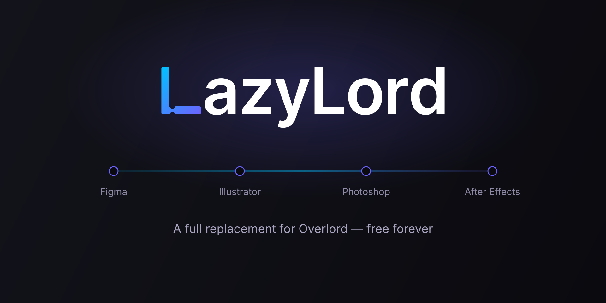

<div align="center">



**Move vectors, live text and images between Figma, Photoshop, Illustrator and After Effects — any of them to any other.**

Select something. Press **Send**. It arrives in the other app as *real* artwork —
editable paths, live text, proper layers — not a flattened screenshot.

[](../../releases/latest)
[](LICENSE)
[](#what-you-need)

**[Download](#download-and-install) · [How to use it](#what-talks-to-what) · [What travels](#what-transfers) · [Trouble?](#if-something-goes-wrong)**

</div>

---

## Why

Getting artwork out of one app and into another usually means exporting SVGs,
re-importing, watching gradients flatten, retyping text that arrived as a
picture, and doing it again every time the design changes.

LazyLord skips all of that. It reads what you selected, describes it in a form
every app understands, and rebuilds it natively on the other side. Send again
after a change and it can **update what it built before, where it stands** —
your position, your grouping, your edits kept.

It is free, open source, and works entirely on your own computer. Nothing is
uploaded, no account is needed, and it keeps working offline.

> LazyLord is an independent, open alternative to Battle Axe's Overlord.
> It is not affiliated with Adobe, Figma, or Battle Axe.

<br>

|  | |
| --- | --- |
| **Real artwork** | Bézier paths stay paths, text stays editable text, images stay images |
| **Both directions** | All four apps send *and* receive — twelve routes in all |
| **Update in place** | Send again and it replaces what it made before, where it sits |
| **Notices your edits** | Changed that layer by hand? It asks before overwriting |
| **Live** | Keep one app updating as you work in another |
| **Honest** | Anything an app cannot rebuild is listed, not silently dropped |
| **Private** | Everything runs on your machine, over your own loopback |

---

## What you need

| | |
| --- | --- |
| **Operating system** | Windows 10 or 11, or macOS |
| **Adobe apps** | Photoshop, Illustrator or After Effects — 2021 or newer. Any one of them is enough |
| **Figma** | Optional. The **desktop app**, not the browser (a browser tab cannot reach your computer) |
| **Anything else** | No. No Node.js, no extension manager, no account, no subscription |

---

## Download and install

### 1. The Adobe panel

1. **[Download `LazyLord-1.0.0.zip`](../../releases/latest)** from the releases page.
2. **Unzip it** — right-click → *Extract All* on Windows, double-click on macOS.
   Do not run anything from inside the zip itself.
3. **Close** Photoshop, Illustrator and After Effects.
4. Run **`1 - Install LazyLord.bat`** (macOS: **`1 - Install LazyLord (macOS).command`**
   — if macOS refuses to open it, right-click it and choose *Open*).
5. Start an Adobe app and open the panel:

   | | |
   | --- | --- |
   | Photoshop | **Window → Extensions (legacy) → LazyLord** |
   | Illustrator | **Window → Extensions → LazyLord** |
   | After Effects | **Window → Extensions → LazyLord** |

That is the whole install. The dot in the panel turns green when it is ready.

> **Keep one LazyLord panel open** while you work. There is no separate program
> to start and no console window to leave running — the first panel you open
> quietly does that job for the others, and for Figma.

### 2. The Figma plugin — only if you use Figma

Figma does not let any installer add a plugin, so the last three clicks are
yours. **`2 - Add the Figma plugin.bat`** (macOS: the matching `.command`) does
everything up to them: it copies the plugin somewhere permanent and puts the one
path you need on the clipboard. Then:

1. Open the Figma **desktop app** — a browser tab cannot reach your computer.
2. **Menu → Plugins → Development → Import plugin from manifest…**
3. In the file window, paste the copied path (**Ctrl+V**, or **Cmd+Shift+G**
   then **Cmd+V** on macOS) and press Enter.
4. Run it from **Plugins → Development → LazyLord**.

Figma asks whether the plugin may talk to `ws://localhost:7878`. That address is
the LazyLord panel on your own machine. Nothing goes anywhere else.

### Updating

Download the new zip and run the installer again. It replaces the old panel.

### Removing it

Run **`Uninstall LazyLord.bat`** from the download (macOS: delete
`~/Library/Application Support/Adobe/CEP/extensions/com.lazylord.panel`).
In Figma: **Plugins → Development → Manage plugins in development → remove**.

---

## What talks to what

Every app both sends and receives, so all twelve directions work:

| sends ↓ / receives → | Figma | Illustrator | After Effects | Photoshop |
| --- | --- | --- | --- | --- |
| **Figma** | — | ✅ | ✅ | ✅ |
| **Illustrator** | ✅ | — | ✅ | ✅ |
| **After Effects** | ✅ | ✅ | — | ✅ |
| **Photoshop** | ✅ | ✅ | ✅ | — |

What each app can *describe* still differs — After Effects has no inner shadow, Illustrator has
no timeline, Photoshop's layer styles are not written — and every one of those gaps is
reported on the transfer rather than left to be discovered. The tables under
[What transfers](#what-transfers) say which.

---

### Transfer from Figma

1. A LazyLord panel open in your Adobe app, its dot green. (That panel is the bridge; nothing else has to be running.)
2. In Figma, select layers, open LazyLord, choose a target (or **All apps**), pick an **Image scale** (1x–4x, default 2x), press **Send**.
3. Watch the layers appear natively in the Adobe document. ✨

If everything you selected sits inside one top-level frame, it lands where it sits in that frame, and a new document or comp is created at the frame's size.

### Sending from an Adobe app

Every panel has a **Send selection** card. It lists every other app that is connected, and the button says where the transfer is going — **Send to After Effects**, **Send to Figma**, and so on.

> Earlier versions labelled these **Push** and **Pull**, following Overlord. Those words name a
> direction through a workflow rather than what the button does — After Effects' button said
> "Pull" while sending artwork *out* — and they stop meaning anything once every app talks to
> every other one. The button now simply names its destination.

The panel has the same **Destination** and **Image scale** choices the Figma plugin does, so a
transfer out of Illustrator can make a new comp the size of the artboard exactly as one out of
Figma can:

| Destination | What the receiving app does |
| --- | --- |
| **Open document** (default) | Into the document or comp already open, where it sits on the page |
| **New — source page size** | A new document or comp the size of the source artboard / composition / canvas, with everything where it sits on it |
| **New — selection size** | A new document or comp the size of the selection, with the artwork at its origin |

### Options: Layout, Hierarchy, Existing and Keyframes

Both the Figma plugin and the Adobe panel have a folded **Options** section. The sender chooses; the receiving app obeys (they travel as `document.options`). Choices are remembered per app.

The Figma plugin also has a **Destination** choice, shown above Options:

| Destination | What the receiving app does |
| --- | --- |
| **New document — frame or object size** (default) | A new Photoshop / Illustrator document or After Effects comp. A whole frame or section gets one its size and name; objects get one their own size and name. |
| **New document — top-level frame size** | A new document the size of the top-level frame the selection sits in, with everything where it sits in that frame. |
| **Open document** | Into the document or comp already open, where it sits in its frame (a new one only when nothing is open). |

With either **New document** choice, selecting several whole frames or sections sends each one separately: every frame gets its own document or comp, at its size and under its name. A frame sent whole is always the page, even without a fill, so its contents keep their place in it.

Transfers pushed from Illustrator or pulled from After Effects always go into the open document or comp, as before.

| Option | Choice | What the receiving app builds |
| --- | --- | --- |
| **Layout** | **Split** (default) | One layer per shape |
| | **Combine** | After Effects: every eligible shape in **one** shape layer, one vector group each. Text, images, gradient-filled shapes and shapes with a different clip stay separate layers (reported). Illustrator and Photoshop ignore it. |
| **Hierarchy** | **Flatten** (default) | Groups dissolve into their layers; a group's opacity is multiplied into its layers (reported when they could overlap) |
| | **Groups** | Illustrator groups, Photoshop layer groups, After Effects parent **nulls** — or nested shape groups when combining |
| **Existing** | **Add** (default) | Every transfer creates new layers |
| | **Update** | A layer an earlier transfer built from the same object is edited where it stands, instead of a duplicate being added |
| **Keyframes** | **Auto** (default) | While updating: a property that is already animated gets a new key at the playhead; a still one is just set |
| | **Always** | Every property LazyLord updates is keyed at the playhead — how you animate a shape by re-sending it |
| **On conflict** | **Overwrite** (default) | While updating: a layer that was edited in the receiving app since it was last sent is updated anyway, and reported |
| | **Keep my edits** | That layer is left as it was edited, and reported |
| **Only what changed** | on (default) | While updating: only the layers whose source changed since the last successful send to that app go out; nothing at all when nothing changed |

Split + Flatten + Add is what earlier versions produced, with two intentional fixes (see [docs/history.md](docs/history.md)).

#### Shape updating

Each layer a transfer builds records where it came from — the source app, the source **document** and the object's own id — in the one writable text field its host gives every layer (an After Effects layer **comment**, an Illustrator **note**). The tag is a single bracketed token, so anything else you keep in that field survives:

```
my own note
[[LazyLord figma|0:1|1:42]]
```

With **Existing: Update**, the receiving app reads those tags back and edits the matching layer instead of adding one. What that changes:

| | After Effects | Illustrator |
| --- | --- | --- |
| What is rewritten | The transform, the outline and the paint — found by searching the layer's contents, not assumed to still be where they were left | The artwork is rebuilt and dropped into the stacking position the old item held; the old item is removed |
| What survives | Its place in the stack, its parent, its effects, its masks, and any property LazyLord does not own | Its place in the stack and the layer or group it was in |
| What does not | — | Anything added to the item itself, such as an Illustrator appearance |
| Keyframes | Animated properties take a key at the playhead rather than a static value, which is what makes re-sending an edited shape animate it | No timeline, so none |

**Photoshop and Figma update the way Illustrator does**: the new version is drawn where the old one stood — same layer group or frame, same place in the stack — and the old one is removed. Their tags live where the user never sees them: in each Photoshop layer's **XMP metadata** (saved in the PSD; not the Background layer), and in each Figma node's **plugin data** (saved in the file). Both keep a fingerprint too, so a layer edited there since the last send is a conflict, as in After Effects and Illustrator. In Figma, a node moved into another frame or group is updated where it now is; only the current page is searched.

Notes worth knowing:

- **The first transfer always adds** — there are no tags to match yet. Send once, then switch to Update.
- **Update ignores Layout and Hierarchy** (reported). Editing layers where they stand cannot also restructure them; send with Add to change the layout.
- **Update needs somewhere to update**, so it always builds into the open document or comp — in the Figma plugin it overrides Destination, and says so.
- **A layer id only matches within its own document.** Node ids, Illustrator `uuid`s and After Effects layer ids all repeat across files, so the document key is part of the tag. An unsaved source has no stable key; its tags match only other keyless ones.
- **Nothing is ever deleted in After Effects.** If a shape no longer holds what the source describes — you added a contour, or deleted a group — the contours that pair up are updated and the mismatch is reported.
- Deleting the tag from a layer's comment or note detaches it: the next Update adds a fresh layer instead.

#### Smart diff, conflicts and Live

- **Smart diff.** Every leaf sent is fingerprinted from its IR. After a successful send the fingerprints are kept per destination app and source document (the Adobe panels in their local storage, the Figma plugin while it is open), and an update leaves out every leaf whose fingerprint has not changed. The paths of images LazyLord generated are not part of it, since they change on every read. An update never deletes, so after deleting a layer in the destination, untick **Only what changed** once to send everything again.
- **Conflicts.** When a build or an update finishes, After Effects and Illustrator add a fingerprint of what LazyLord wrote to the tag — `[[LazyLord figma|0:1|1:42~k3f9.2a]]` — and the next update compares it with the layer as it is now. After Effects reads the transform, outline, paint, text and footage (an animated property by its keys, a still one by its value before expressions, so neither the playhead nor an expression counts as an edit); Illustrator the geometry, points, paint, text and linked file of the items made from one layer. **On conflict** decides what happens to a layer that differs. Tags written before fingerprints never conflict and gain one on their next update.
- **Live needs one destination**: any single app — After Effects, Illustrator, Photoshop or Figma — but not "All apps", whose apps can each hold something different.
- **Live.** Tick **Live — send changes as you work** under the Send button. In Figma, the objects selected at that moment are watched (the page's `nodechange` event, debounced by 600 ms) and exported again when anything inside them changes. In the Adobe panels, a cheap stamp of the selection (`LazyLord.liveStamp`: AE's selected layers and their fingerprints, Illustrator's selected items, Photoshop's history state and selected layers) is polled every 1.5 s. Each change goes as an update of only what changed, into the open document; a change made while a send is under way waits for it. Live sends are logged but kept out of the history. It stops by itself when what it watches is gone, or the bridge or destination disconnects.

After every transfer the panel prints a one-line summary (layers, images — originals vs. generated — and fallbacks by kind), and lists anything that needed a fallback, naming the object and the reason, sorted skipped → rasterized → approximated.

---

## Making the window the size you want

- **The Figma plugin** has a grip in its bottom-right corner. A plugin window is only ever the
  size the plugin asks for — there is no window chrome to drag — so the grip *is* the chrome:
  drag it and the window resizes. The size is remembered and restored next time you open it.
- **The Adobe panel** resizes the way every Adobe panel does, by dragging its edge. Dock it,
  float it, make it tall and narrow beside your artboard — it reflows rather than overflowing,
  so the rows of buttons go from one column to as many as fit.

## What transfers

### Figma → Photoshop / Illustrator / After Effects

| Content | After Effects | Illustrator | Photoshop |
| --- | --- | --- | --- |
| Vector shapes (bezier) | Shape layer | Path / compound path | **Editable shape layer** (raster fill as fallback) |
| Rectangle / ellipse | **Live Rect / Ellipse shape** | Path | Shape layer |
| Solid fill & stroke | ✅ (weight/cap/join) | ✅ | ✅ stroke on the shape layer where possible |
| Linear / radial gradient | Gradient Ramp effect (2 stops) | **Native gradient**, direction and length | **Gradient fill layer** |
| Clipping frames & masks | Layer masks | Clipping group | Layer group with a vector mask |
| Frames & groups | Parent nulls / shape groups (*Groups*) | Groups (*Groups*) | Layer groups (*Groups*) |
| Frame backgrounds | Shape layer | Path | Shape layer |
| Live, editable text | ✅ | ✅ | ✅ |
| Font family + style | best-effort | best-effort | best-effort |
| Images / rasters | Footage | Placed image, embedded | Smart object |
| Rotation | ✅ about the centre | ✅ | ✅ |
| Opacity, position & size | ✅ | ✅ | ✅ |

Figma rotation used to pivot on the layer's top-left; vectors now have their transform baked into the geometry, and text and images turn about their centre on every host. Diagonal linear gradients keep the angle Figma shows, on non-square and rotated shapes too.

### Illustrator → After Effects

| Illustrator object | Becomes | Notes |
| --- | --- | --- |
| `PathItem` | AE shape layer | Full bezier fidelity; rectangles and ellipses become live Rect / Ellipse shapes |
| `CompoundPathItem` | One shape layer, even-odd | Holes are preserved |
| `GroupItem` | Parent null (*Groups*) or flattened | Group opacity carried |
| Clipping group | Layer masks on its contents | Nested masks keep the innermost (reported) |
| `TextFrame` (point text) | Editable AE text | On its **real** baseline, rotation carried |
| `TextFrame` (area text) | Editable AE text | Rebuilt as point text; the box is not carried over |
| `PlacedItem` (linked) | AE footage | Uses **your original file** — never re-encoded; rotation carried |
| `RasterItem` (embedded) | AE footage | Exported to `@2x` PNG |
| Mesh, symbol, live effect | AE footage | Rasterised via a scratch document, and reported |
| Linear / radial gradient | Gradient Ramp | Real gradient vector, including later transforms |
| RGB / CMYK / Gray / Spot | AE colour | CMYK converted through Illustrator's own engine |

### After Effects → Illustrator

| AE layer | Becomes | Notes |
| --- | --- | --- |
| Shape layer, drawn path | Illustrator path | Full bezier fidelity, tight bounds |
| Shape layer, rect / ellipse / polystar | Illustrator path | Parametric shapes are generated; polystar roundness is dropped and reported |
| Shape layer with several painted groups | A group of paths | Each group keeps its own fill/stroke; group opacity carried |
| Fill / stroke | Solid colour, width, cap, join, fill rule | Stroke width scales with the baked transform |
| Gradient Ramp effect | Gradient fill | So LazyLord's own AE gradients round-trip |
| Layer masks (Add) | Clipping group | Other mask modes, feather and inverted masks are reported |
| Text layer | Live Illustrator text | On its real baseline, rotation carried |
| Footage layer | Placed image | Uses **your original file**; rotation carried |
| Solid layer | Filled rectangle | A solid is just a coloured rect |
| Parented layers | Placed correctly | The whole parent chain is composed |
| Selected parent null | Group | Its selected children go inside |
| Track matte | — | Reported, not transferred |
| Camera, light, precomp, null | — | Skipped and reported |

### Assets

- **After Effects:** images LazyLord generated are copied next to your saved project in `LazyLord Assets/` (never overwriting; `-1`, `-2`… appended) and imported from there. In an unsaved project they stay in the temp folder, and the panel says so. Your own linked files are never copied.
- **Illustrator:** generated images are embedded; your own files stay linked.

### Blend modes and effects

A layer's blend mode and its shadows and blurs travel with it, in one shared vocabulary
(`BlendMode` and `Effect` in `packages/core/src/ir.ts`). What a host cannot rebuild it reports,
naming the layer and what was lost — it is never dropped quietly.

| | Figma | After Effects | Illustrator | Photoshop |
| --- | --- | --- | --- | --- |
| **Blend modes** (all 16) | ✅ native | ✅ native | ✅ native | ✅ native |
| **Drop shadow** | ✅ native | ✅ Drop Shadow effect | reported | reported |
| **Shadow spread** | ✅ native | reported | reported | reported |
| **Inner shadow** | ✅ native | reported | reported | reported |
| **Layer blur** | ✅ native | ✅ Gaussian Blur | reported | reported |
| **Background blur** | ✅ native | reported | reported | reported |

Worth knowing:

- **After Effects describes a shadow differently.** It has no x/y offset — it has a direction
  dial and a distance — so the IR's offset is converted into them. Its Drop Shadow also has no
  spread, so a shadow that uses one is rebuilt without it and says so.
- **A blur radius is not the same number everywhere.** Figma's radius is a standard deviation;
  AE's Blurriness is roughly twice it for the same look, and is converted.
- **Illustrator live effects and Photoshop layer styles are not rebuilt.** Both live in
  ActionManager with parameters that do not line up with anyone else's, so approximating them
  would be guesswork. They are reported instead.
- **A rasterised layer keeps its effects in its pixels**, so its effects are deliberately *not*
  sent as well — otherwise every shadow would be drawn twice. Its blend mode still travels,
  because an export renders the layer, not how it composites with what is under it.
- A blend mode a host does not have leaves the layer Normal, reported.

## Reliability, history and presets

- **All or nothing.** If a build stops part-way with an error, what it had made is taken back:
  - **After Effects:** new layers and project items are removed. They are matched by id, so the user's own are never touched.
  - **Illustrator:** new items are removed by uuid, and a document the transfer opened is closed unsaved.
  - **Photoshop:** the document steps back to its history state before the build, so Redo can bring it back.

  Anything that cannot be identified is left alone, and the error says so. Per-layer fallbacks still give a partial build with diagnostics, as before. Layers an *Update* had already edited stay edited (use Undo). Figma builds are not rolled back yet.
- **Large transfers** (JSON over 4 MB, usually because of images) travel in 1 MB chunks that the receiver joins back together, staying well under the bridge's 100 MB message limit.
- **Temporary files.** Transfer folders in `<temp>/lazylord` older than 7 days are removed when a panel starts. Until then, an After Effects project that was never saved still links its generated images from there.
- **History.** The Adobe panels and the Figma plugin keep the last 25 transfers sent and received: when, where to or from, what, how many layers, and any fallbacks or failure. It is kept per app, and can be cleared.
- **Presets.** The Options section can save the Destination, Image scale and options under a name and bring them back in one step.

## Known limitations

- **After Effects gradients** come from the Gradient Ramp effect because scripts cannot set shape-layer gradient colours. A Ramp has two colours and no per-stop transparency: extra stops are dropped and uneven alpha is averaged, both reported. Gradient **strokes** become their first colour.
- **After Effects gradient fills cannot be read** from shape layers (only LazyLord's Gradient Ramps can); those shapes arrive unfilled, and the panel says so.
- **Photoshop gradients** longer than Photoshop's 150% scale limit are clamped (reported). Diagonal gradients on long, thin Figma shapes hit this.
- **Font mapping** relies on family/style name matching; unusual fonts may fall back to the host default.
- **Mixed-style text** travels as runs (font, size, colour, tracking per range) and is rebuilt as live text; After Effects needs 24.3 or newer for it (`TextDocument.characterRange`), and older versions take the first run's style, reported.
- **Effects:** blend modes travel everywhere, and After Effects rebuilds drop shadows and layer blurs; other effects, layer styles and AE path operators (Merge, Trim, Repeater…) are not transferred, and are reported.
- A clip on a group (rather than on its layers) is not rebuilt by After Effects. No source produces one today.
- Combining shapes in After Effects may pull a shape above its neighbours when only some shapes in a Figma clipping frame carry the clip (reported).
- **Updating into Photoshop rests on layer XMP.** Photoshop layers have no comment or note, so the tag is written to each layer's XMP metadata (through AdobeXMPScript when it loads, else as a small XMP packet of its own). A pixel edit that changes neither bounds, opacity, blend, text nor fill colour is not seen as a conflict.
- **Updating does not restructure.** Layout and Hierarchy are ignored while updating, and an Illustrator update replaces the item rather than editing it, so an appearance added to that item in Illustrator goes with it.
- **An After Effects gradient is not updated.** Its colours are written to the underlying solid fill, but the Gradient Ramp effect is left as it was (reported). Re-send with Add for a gradient that changed.
- **Figma cannot read a file**, so anything sent there travels as bytes rather than as a path — the panel reads the file and embeds it. A transfer that reaches Figma with only a path (from a host that could not read it) reports the image rather than dropping it silently.
- **Photoshop can only read its selection through ActionManager.** If that call fails, only the active layer is sent, reported. Its shape layers also need both a vector mask and a readable fill colour; without either, the layer is rasterised instead.
- **Not yet implemented:** Illustrator live effects and Photoshop layer styles.
- **Updating into Figma** searches only the current page, and does not roll a failed build back.
- **Live in the Adobe panels polls.** CEP gives a panel no change events, so the selection is stamped every 1.5 s. Illustrator reads at most 500 selected items and a few thousand path points per poll (bounds past that); After Effects does not treat a playhead move as a change, so values that only change by scrubbing are not re-sent.
- **Version 1.0 is new.** Sending, receiving, updating in place, conflict detection and Live have all been run by hand in the real apps — including the case everything rests on, where the file is saved, closed, reopened, and an update still finds the layers it made rather than adding a second copy. Over two thousand automated checks run against mocked hosts on top of that. Adobe scripting still differs between app versions, so something can behave differently on yours: the panel's **Log** usually says why, and [telling me](../../issues) is how it gets fixed. What has been reasoned out rather than exercised is listed in [docs/development.md](docs/development.md).

---

---

## If something goes wrong

| What you see | What to do |
| --- | --- |
| **LazyLord is not in the Window menu** | Restart the app. Adobe only looks for new panels while it starts up. |
| **The panel opens blank** | Run **`Fix a blank panel.bat`** from the download folder and restart the app. On macOS, in Terminal: `defaults write com.adobe.CSXS.11 PlayerDebugMode 1`. Adobe's signature check fails on some machines; this tells it to load the panel anyway. |
| **The dot never turns green** | Something else may be holding port 7878. Close other panels and start the app again with only LazyLord open. |
| **Figma says it cannot connect** | Open a LazyLord panel in Photoshop, Illustrator or After Effects first, and use the Figma **desktop app** — a browser tab cannot reach your computer. |
| **Something arrived wrong** | Open **Log** in the panel and copy what it says, then [open an issue](../../issues) with that and a screenshot of both sides. The panel lists everything it could not rebuild, so the answer is usually already in there. |

---

## Questions people ask

**Is it really free?**
Yes. MIT licensed — free to use, at work too, and free to change.

**Does my work leave my computer?**
No. The apps talk to each other over your own machine's loopback address, the
same way a local preview server works. There is no server, no account, and no
telemetry. Unplug the internet and it still works.

**Do I need Overlord, Node.js, or an extension manager?**
No. The download is self-contained.

**Why does Photoshop call it "Extensions (legacy)"?**
That is Adobe's own menu name for this kind of panel. Nothing is wrong.

**Will it touch my existing layers?**
Only if you ask. **Add** always makes new layers. **Update** replaces what
LazyLord itself made earlier, and if you have edited one of those layers by
hand it stops and asks which version to keep.

**Can I use it with Figma in the browser?**
No — a browser tab cannot reach your computer. The Figma desktop app can.

**Windows and macOS both?**
Yes. The installer for each is in the download.

---

## Changing it yourself

LazyLord is open source and the code is meant to be read. Building it,
running the test suites and how the pieces fit together are in
**[docs/development.md](docs/development.md)**. Packaging a signed release of
your own is in **[PUBLISHING.md](PUBLISHING.md)**, and
**[docs/history.md](docs/history.md)** keeps the notes from how it was built.

Issues and pull requests are welcome.

---

## Who made this

LazyLord is designed and built by **[Raisul Sohan](https://raisulsohan.com/)**.

If it saved you an afternoon, [say hello](https://raisulsohan.com/). If it did
not, [tell me why](../../issues) — that is more useful.

## Licence

[MIT](LICENSE). Use it, change it, ship it. Adobe, Photoshop, Illustrator,
After Effects and Figma are trademarks of their respective owners.
